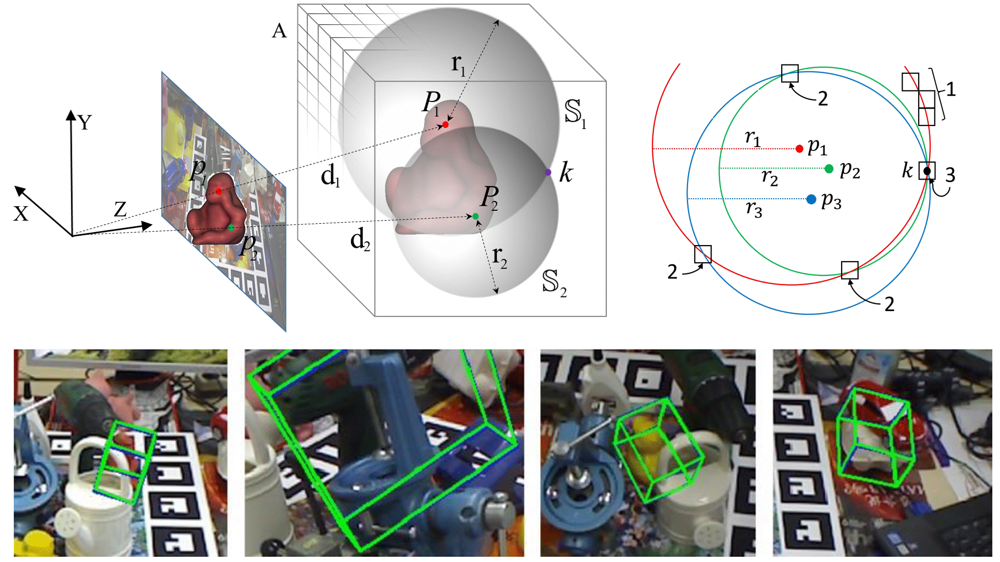

# RCV(Radial Keypoint Voting) Pose



> [Vote from the Center: 6 DoF Pose Estimation in RGB-D Images by Radial Keypoint Voting](https://arxiv.org/abs/2104.02527 "arxiv")
> Yangzheng Wu, Mohsen Zand, Ali Etemad, Michael Greenspan
> ECCV 2022
## Updates
[Liam Salass](https://github.com/Liamsalass/) has commited to the most recent updates and this is a special thanks to him!

RCVPose can be trained without the pre-generation of radii maps, just simply run the train script directly.

To avoid issues of ckpts trained on multiple GPUs, pre-trained [radii maps](https://queensuca-my.sharepoint.com/:f:/g/personal/16yw113_queensu_ca/Eh6ucFDRsMFOsw31lPopfoEBICl8ghNzUe45BDYkgf1xQA?e=wrWcHQ) are now provided for testing.

## Prior to Usage

In order to use this repo, the environement and datasets need to be prepared and downloaded.

The code has been run and tested on both `Windows(10,11)` and `Linux(Ubuntu 22.04)`, not `Mac OS`.

### Dependencies

Install PyTorch prior to other python packages:

Follow the official installation guidance of [PyTorch](https://pytorch.org/) and [Nvidia](https://docs.nvidia.com/cuda/index.html), and install the compatibale version of both [cuda](https://developer.nvidia.com/cuda-downloads) and [PyTorch](https://pytorch.org/get-started/locally/) for the GPU.

Install the rest dependencies by using conda:

```
conda env create -f environment.yml
conda activate rcvpose
```

### LINEMOD Dataset

Download [LINEMOD and Occlusion_LINEMOD](https://queensuca-my.sharepoint.com/:u:/g/personal/16yw113_queensu_ca/EcDsKd-cPIhDrfgfmeHnjCkBnd84Vxe8oklS8VEm5c3cug?e=E8bXcR).

Download [dispersed keypoints](https://queensuca-my.sharepoint.com/:f:/g/personal/16yw113_queensu_ca/Em2J6Ka9F4xMpKO4bko86kwBqrGu_6hINHo9KGQFmH8ihA?e=N5VN8a) and [train/test split](https://queensuca-my.sharepoint.com/:f:/g/personal/16yw113_queensu_ca/Eh4gWJtf2ndCsVK2LgdPfxcBd1vAPFpduTxq8LnfZomD_g?e=19FwYq) and unzip it into LINEMOD root, there should exist a 'Outside9.npy' file once finished.

### Radial Map Generation

In order to train the network, radial maps are required as the GT label and they can be generated by running:

```
python 3DRadius.py
```

Based on our experiments, three keypoints are sufficient enough for optimal performance. After the radial map generation is done, there should be a series of folders named `Out_pt*_dm` within each object's folder.

## Training and Testing

The [pre-trained models](https://queensuca-my.sharepoint.com/:f:/g/personal/16yw113_queensu_ca/EmSWfjRys1tJkWdsCP4zVsIBwIwY0AXoDBVK1n51LUWK0g?e=kUpEhn) can be downloaded and tested directly without training. The ckpts can now work on any GPU configurtaions, if not, please raise an issue(<del>Note that the checkpoints will only work when [PyTorch data parallel](https://pytorch.org/docs/stable/generated/torch.nn.DataParallel.html) is enabled.</del>).

## Train & Test

### Train RCVPose

For training, simply run:

```
python main.py --root_dataset="PATHTODATA" --kpt_num='1' --mode=train --batch_size=32 --optim='Adam' --initial_lr=1e-4 --resume=False
```

The code is compatibale with [multi-GPU training](https://pytorch.org/docs/stable/generated/torch.nn.DataParallel.html) and it is fully automatic.

Track the training process by using [Tensorboard](https://www.tensorflow.org/tensorboard):

```
tensorboard --logdir='PATHTOLOG'
```

Three networks are required to be trained before testing as RCVPose use one network for each keypoint.
At the project root, create a 'ckpts' folder and save the best models there.

### Test RCVPose

For testing, download [pretrained radii](https://queensuca-my.sharepoint.com/:f:/g/personal/16yw113_queensu_ca/Eh6ucFDRsMFOsw31lPopfoEBICl8ghNzUe45BDYkgf1xQA?e=S24NeJ), simply run:

```
python main.py --root_dataset="D:/Datasets/6dPoseData/LINEMOD/" --mode=test --demo-mode=False
```

For testing with ckpts on multiple GPU on a linux, run:
```
python main.py --root_dataset="D:/Datasets/6dPoseData/LINEMOD/" --mode=test --demo-mode=False --using_ckpts=True
```


Enable the demo mode if the visualization result is required.

## Citation

If our work helps your work, we respectively ask for citations:

    @inproceedings{wu2022vote,
          title = {Vote from the Center: 6 DoF Pose Estimation in RGB-D Images by Radial Keypoint Voting},
          author = {Wu, Yangzheng and Zand, Mohsen and Etemad, Ali and Greenspan, Michael},
          booktitle = {European Conference on Computer Vision (ECCV)},
          year = {2022},
          organization={Springer}
	  }

## Acknowledgement

This project is sponsored by Bluewrist Inc. and NESERC(Natural Sciences and Engineering Research Council of Canada).
